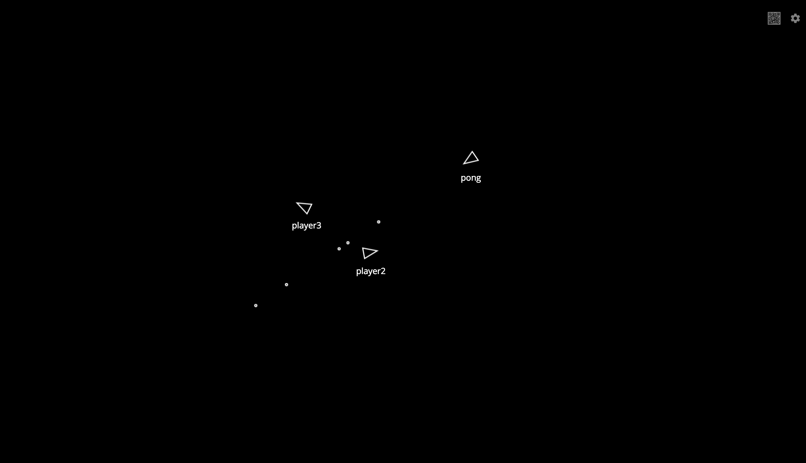
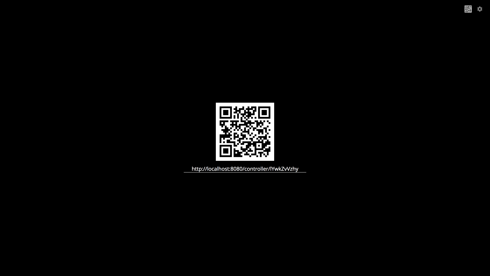
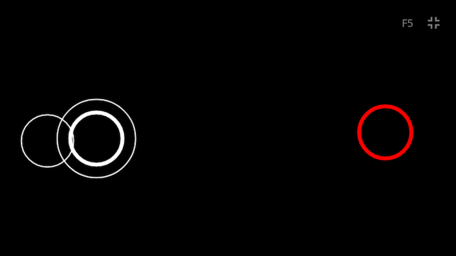

# Spacecraft
> a simple socket.io game prototype


## Usage

```
git clone https://github.com/Pong420/Spacecraft.git
npm install
npm run dev
```

Open ```http://localhost:8080``` and click on the QRCode icon at the upper right conner


Then click on the larger QRCode to access the controller (controller only available for touchable device)

OR 

Edit the url under QRcode, replace 'localhost' with your desktop IP address assigned by the router ( [How can I access my localhost from my Android device](https://stackoverflow.com/questions/4779963/how-can-i-access-my-localhost-from-my-android-device) ) and scan the QRCode with your mobile phone


Enter a nickname and submit


## Reference
- [Multi-touch game controller in JavaScript/HTML5 for iPad](http://seb.ly/2011/04/multi-touch-game-controller-in-javascripthtml5-for-ipad/) 
- [sokect.io](https://socket.io/)